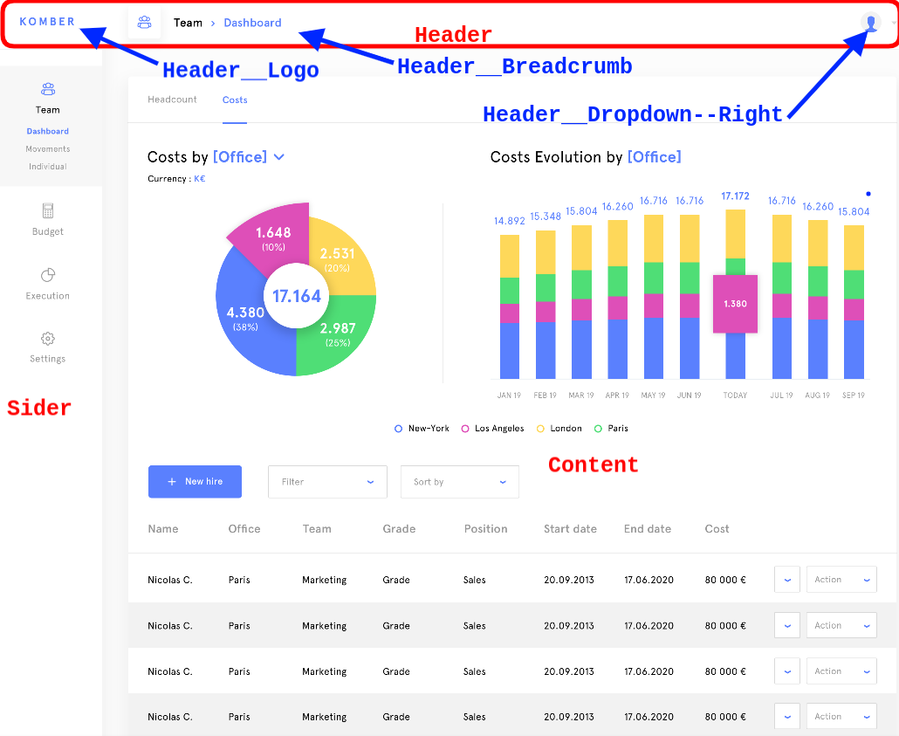

# Komber naming convention

## Vuejs naming convention

All vue button action will be prefixed by "handle" vs the service actions which are not prefixed

### Update an object

Edit: display a form to update an object
Update: action to update an object

Example:
* handleEditOffice will display the edit form of the current office
* handleUpdateOffice will perform the saving of the office

### Create an object

Add: display the form to add an object
Create: action to save this new element in DB

Example:
* handleAddOffice
* handleCreateOffice

## CSS management

We use BEM (Block, Element, Modifier) convention in order to name our classes:

  * BlockName
  * BlockName--ModifierName
  * BlockName__ElementName
  * BlockName__ElementName--ModifierName

Here are some examples:



In a Scss file we will construct our BEM CSS like following:

```
  .BlockName {
    &__ElementName{
      @extend .BlockName;
      prop: value;
      &--ModiferName{
        @extend .BlockName__ElementName;
        prop: value;
      }
    }
    &--ModiferName{
      @extend .BlockName;
      prop: value;
    }
  }
```

Let's organize our classes like following

```
  .MyClass {
    // Positioning
    position: absolute;
    top: 0;
    left: 0;
    z-index: 1;

    // Box-model
    display: block;
    width: 100px;
    height: 100px;
    margin: 10px 9px 12px;
    padding: 10px;

    // Typography
    font: bold 12px/14px 'Helvetica', sans-serif;
    color: white;
    text-align: center;

    // Visual
    background-color: red;
    border: 1px solid blue;
    border-radius: 3px;

    // All other properties
    cursor: pointer;
    pointer-events: none;
    opacity: .5;
  }
```

Useful link :
* https://sass-lang.com/guide
* https://www.alsacreations.com/article/lire/1641-Bonnes-pratiques-en-CSS--BEM-et-OOCSS.html (French)
